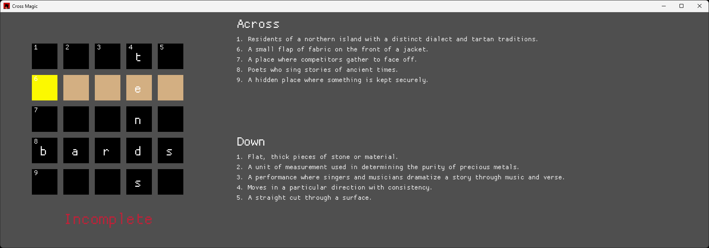

# Cross Magic

## About

A game of 5x5 perfectly square crosswords featuring auto-generated puzzles.

Using macroquad for rendering and ollama for generation.

## Example

## Source

Word squares were generated from this project: https://github.com/BartMassey/ws5

## Requirements

Install ollama from https://ollama.com/. Make sure to run it in the background, where it should be hosting an API server by default.

Currently, Cross Magic assumes the usage of the qwen3 model as an LLM. You may need to add this to ollama via the `ollama pull qwen3` command, first.

## Contact

Feel free to contact me at benjamin.w.massey@gmail.com with any questions / inquiries.